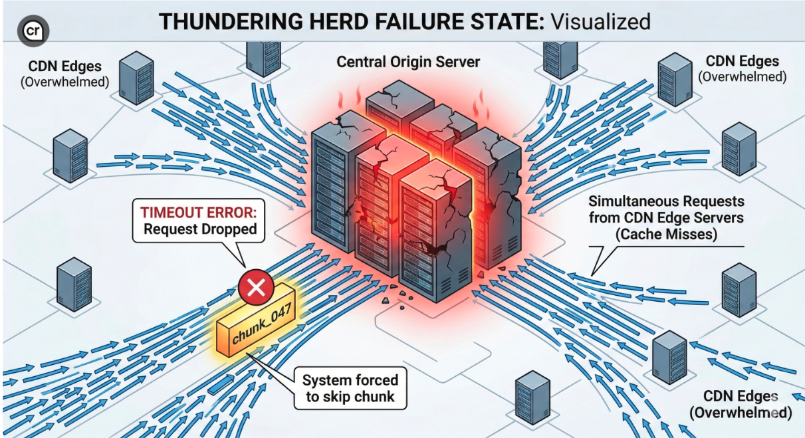
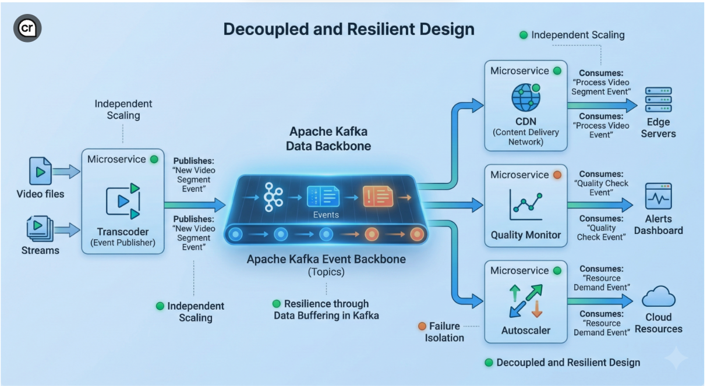

Yesterday, during the cricket match, Hotstar reportedly had 84.1 crore viewers online. That's not just a record — that's one of the largest live streaming events in human history.

But if you were watching carefully, you might have noticed something: **a missing 3–5 seconds here, the same footage playing twice there.**

I did. And instead of ignoring it, I started thinking — *what actually broke, and why?*

Here's the full architectural breakdown, from stadium camera to your mobile/TV.

## The Pipeline Nobody Thinks About

When you watch a live match on Hotstar, the video doesn't travel directly from the stadium to your phone. It goes through an entire assembly line of systems.

Here's what that looks like:

```
Stadium Camera
      ↓
Ingest + Transcoder  (creates 4–6 sec video chunks, multiple quality levels)
      ↓
Origin Server  (single source of truth)
      ↓
Origin Shield  (mid-tier cache, absorbs traffic spikes)
      ↓
CDN Edge Servers across India  (Kochi, Bengaluru, Delhi, Mumbai...)
      ↓
Your Phone
```

The live stream isn't one continuous video file. It's a **never-ending series of small video chunks** — each 4–6 seconds long — being created, distributed, and played in sequence.

Alongside these chunks, a small text file called the **manifest (.m3u8)** acts as a playlist. Your Hotstar app polls this file every 2–3 seconds to know which chunk to download next.

## Why Were 3–5 Seconds Missing?

This is called a **thundering herd problem**.

Here's exactly what happened:

1. The transcoder creates `chunk_047.ts` (5 seconds of live cricket) at the origin server.
2. The CDN edge server near you **hasn't cached it yet** — cold cache.
3. Your app asks the edge server for `chunk_047`. Edge says "I don't have it" and asks the origin.
4. But **millions of edge servers across India are doing the same thing simultaneously.**
5. The origin server gets hit by millions of requests at once — it slows down, times out.
6. Your app waits, retries, eventually gives up and skips to `chunk_048`.
7. You just permanently missed 5 seconds of live cricket.



And here's what makes it worse: **the manifest file keeps moving forward regardless.** It only shows the last few live segments. Once `chunk_047` falls off that window, it's gone. You can't go back. That's why `chunk_048` played fine — by the time your app re-polled the manifest, `047` was old news and `048` was the new latest chunk.

## Where Kafka Fits In

Hotstar almost certainly uses **Apache Kafka** as the backbone connecting all their microservices — a high-speed event conveyor belt.

Every time the transcoder creates a new chunk, it publishes an event to a Kafka topic. Downstream services — CDN uploader, manifest updater, quality monitor, autoscaler — all consume that event independently:

```
Transcoder → Kafka: "chunk_047 is ready"
              ↓            ↓               ↓
        CDN Uploader  Manifest Updater  Quality Monitor
```



This decoupling is critical. If the CDN uploader is slow, it doesn't block the transcoder. If the quality monitor crashes, chunk delivery keeps going. Each service fails independently.

Kafka also carries **real-time playback telemetry** — buffering rates, quality switches, drop-offs — from 65 crore devices back into the system. If buffering rates spike in Chennai, an autoscaler service can spin up more capacity in that region before things get worse. The entire feedback loop runs on Kafka streams.

## The Honest Reality

At 84 crore concurrent viewers, Hotstar is operating at a scale that very few systems in the world have ever faced. Their pre-warming, multi-CDN routing, origin shields, and Kafka-driven autoscaling are genuinely impressive engineering.

But physics and probability are unforgiving. A single delayed segment at the origin propagates to millions of players simultaneously. A notification spike can invalidate CDN caches faster than any system can react. And at this scale, even a **99.999% success rate** means 65,000 people having a bad experience at any given moment.

What you saw — the missing seconds, the looped footage — wasn't a bug. It was the system's **recovery behavior**, doing exactly what it was designed to do under extreme stress.

That's the invisible engineering behind every live cricket match. Next time you watch, you'll see it differently.

---

*Curious about system design at scale? Drop your thoughts in the comments.*

---

**Sources**
- [Tech Behind IPL Live Streaming on Hotstar — LinkedIn](https://www.linkedin.com/pulse/tech-behind-ipl-live-streaming-hotstar-simplified-frontend-kumar-x0wlc/)
- [Hotstar Tech Stack — VdoCipher](https://www.vdocipher.com/blog/hotstar-tech-stack/)
- [Case Study: Streaming Platform Eliminates 80% Buffering — BlazingCDN](https://blog.blazingcdn.com/en-us/case-study-streaming-platform-eliminates-80-percent-buffering-video-cdn)
