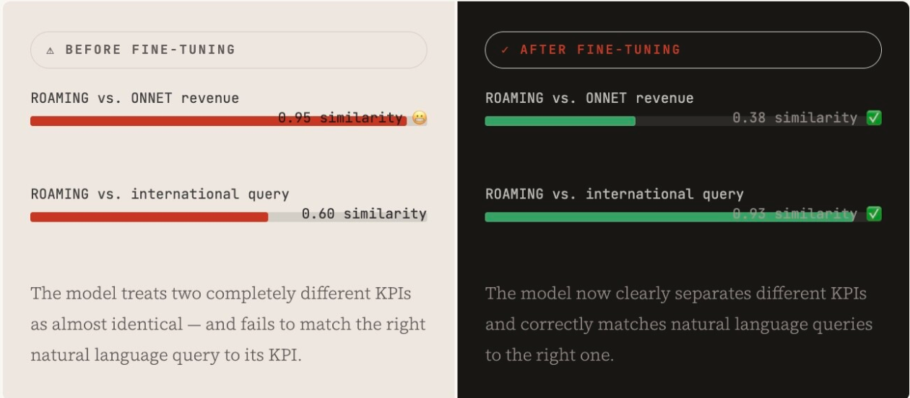
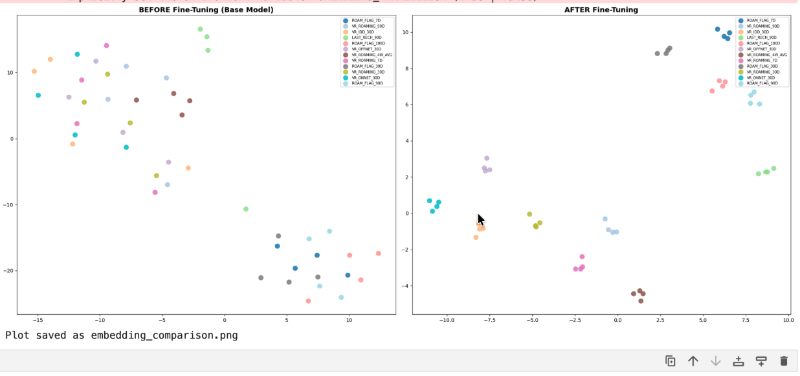

Imagine you have a database of 875 telecom KPIs (Key Performance Indicators) — metrics like roaming voice revenue (last 4 weeks), on-net voice revenue (last 8 weeks), and date of last prepaid recharge (90 days). Now imagine you need to let analysts, business users, and systems ask questions in plain English and have the right KPI surface automatically.

That's exactly what we built. And the first time we tried it with a base model like `BAAI/bge-base-en-v1.5`, the base model got the answer right **31% of the time** — that's the average accuracy measured using a k-fold split approach with no training.

After fine-tuning, it hits **96.68%**.

Here's the story of how that happened and why it matters.

For this example:
- ~875 unique KPIs
- 4,375 training records
- 5,244 training pairs

## The Problem: Every Telecom KPI Sounds Like Every Other KPI

Telecom KPI names follow a strict naming convention. Take these three:

```
VOICE_REVENUE_ROAMING_FINANCE_REV_4W_AVG
VOICE_REVENUE_ONNET_FINANCE_REV_8W_AVG
VOICE_REVENUE_OFFNET_FINANCE_REV_30D
```

To a human with domain knowledge, these are clearly different things — roaming charges vs. on-network calls vs. off-network calls, different time windows, different billing contexts.

To a general-purpose AI model? They look almost identical. All three mention "voice," "revenue," "finance." The model has no idea that your business cares deeply about the difference.

> *"The model spoke English. It just didn't speak our English."*

## What Are Embeddings? (The Simple Version)

Embeddings are how AI models represent meaning as numbers. Every sentence gets converted into a long list of numbers — a "vector" — where sentences with similar meaning end up with similar numbers, placed close together in what's called a "vector space."

Think of it like a map. Cities in the same country sit close together. Cities on different continents are far apart. Embeddings do the same thing with language — they place "Can't log in" close to "Password not working" and far from "I want to cancel."

When a user types a question, we embed their query and find the nearest KPI on that map. The KPI closest to the query is the answer.

The problem? Our 875 KPIs were all clustered in the same tiny neighborhood on the general model's map. The model couldn't tell them apart because it had never been taught the difference.

## Fine-Tuning: Teaching the Model Our World

Fine-tuning is the process of taking a pre-trained model and continuing to train it on your own examples so it learns what *you* consider similar and different. That means we are changing the business domain knowledge — the KPIs we have. The embedding model has certain values in the dimension space: we are trying to adjust those values with our domain knowledge.

We had a powerful starting point: each of the 875 KPIs already had 5 descriptions written in different styles — technical definitions, analyst queries, business use cases. For example, for the roaming voice revenue KPI:

```
# KPI: VOICE_REVENUE_ROAMING_FINANCE_REV_4W_AVG

"This metric calculates the 4-week average of finance-validated
 revenue from voice calls processed through the roaming billing system."

"Use this roaming revenue data to identify high-value outbound
 travelers for premium loyalty offers."

"What is the average weekly revenue from international calls made
 by our customers while traveling abroad over the past month?"

"Show me the average roaming income from voice calls for the
 last four weeks to track ARPU performance."
```

These 5 descriptions are all describing the same thing in different words. That's pure gold for training.

## The Pipeline: Step by Step

### 1. Data Preparation — Split Train & Test

For each of the 875 KPIs, we kept 4 descriptions for training and held 1 back as a test. This means the model never sees the test sentence during training — giving us a clean, honest accuracy score at the end.

### 2. Generate Positive Pairs

For each KPI, we paired every training description with every other. From 4 descriptions, you get 6 unique pairs (4C2 = 6). These are "positive" pairs — sentences the model should learn to treat as equivalent.

Total: 875 × 6 = **5,250 positive pairs**.

### 3. Mine Hard Negatives — The Most Important Step

A "hard negative" is a description from a *different* KPI that sounds very similar to yours. We used the base model to find which KPIs it was already confusing — those became our most valuable training examples. If the model couldn't distinguish them before training, teaching it to is exactly where fine-tuning earns its value.

### 4. Train with MultipleNegativesRankingLoss (MNRL)

MNRL is a loss function that takes a batch of (query, correct-answer) pairs and forces the model to rank the correct answer above all other answers in the batch. Every other positive in the batch automatically becomes a negative — making training very data-efficient. We trained for 3 epochs on the `BAAI/bge-base-en-v1.5` base model.

### 5. Evaluate on Held-Out Test Set

We embedded all 875 held-out test sentences and found the nearest KPI for each. If the nearest neighbor was the correct KPI, that's a hit. We measured **Recall@1** — did the top result match?

**Result: 31% → 96.68%**

I could also go with Recall@5 or Recall@4, because that depends on my RAG Q-value. With a RAG Q-value of 5, I would have more accuracy. However, I need to test the hardest case possible — that's why I'm going with Recall@1.

## The Visual Proof: Before vs. After Similarity

Here's what the model's confusion looked like in practice — for a pair of KPIs that look nearly identical:



Before fine-tuning, the model treats two completely different KPIs as almost identical and fails to match the right natural language query to its KPI. After fine-tuning, the model clearly separates different KPIs and correctly matches natural language queries to the right one.

## The t-SNE Embedding Space

To visualize what fine-tuning actually did, we ran a technique called t-SNE — which takes the high-dimensional embedding vectors and squashes them down to a 2D scatter plot you can look at.

The t-SNE visualization is just a way to showcase the embeddings in 2D or 3D space, whereas the actual model embeddings will be in more than 100 or 200 dimensions. In our case, it ranges to something around 700+ dimensions.



**Before fine-tuning:** all voice revenue KPIs were one big overlapping blob. The model couldn't tell roaming from on-net from off-net. Every dot was on top of another.

**After fine-tuning:** each KPI formed its own tight, distinct cluster — clearly separated from every other KPI, with clean space between them. The model had built its own internal map of our telecom domain.

That's the clearest possible proof that fine-tuning worked: the model reorganised its entire internal representation of the data around the relationships that matter to *us*.

## Why Hard Negatives Do 80% of the Work

Most explanations of fine-tuning skip over this, but hard negatives are where 80% of the learning happens.

An "easy negative" would be pairing a roaming revenue KPI with a "last recharge date" KPI as a negative example. The model already knows those are different. Teaching it again adds nothing.

A "hard negative" is pairing roaming voice revenue (4-week average) with on-net voice revenue (8-week average) as a negative example. The model currently thinks those are basically the same thing. Correcting it is where the real accuracy gains come from.

```python
from sentence_transformers import SentenceTransformer, InputExample, losses
from torch.utils.data import DataLoader

# 1. Load a base model
model = SentenceTransformer("BAAI/bge-base-en-v1.5")

# 2. Structure training pairs — (query, correct KPI description)
#    Other items in the batch automatically become hard negatives (MNRL)
train_examples = [
    InputExample(texts=[
        "avg roaming income from voice calls last 4 weeks",  # query
        "4W_AVG finance-validated revenue from roaming voice calls"  # correct KPI
    ]),
    InputExample(texts=[
        "when did this prepaid customer last top up?",  # query
        "timestamp of the final prepaid top-up within 90 days"  # correct KPI
    ]),
    # ... 5,244 more pairs
]

# 3. Train with MultipleNegativesRankingLoss
loader = DataLoader(train_examples, batch_size=32, shuffle=True)
loss = losses.MultipleNegativesRankingLoss(model)
model.fit(train_objectives=[(loader, loss)], epochs=3)
```

## How It Works in an Actual Scenario

This fine-tuned model now sits at the core of an intelligent KPI search engine deployed in an n8n automation workflow. When a query comes in — from an analyst, a dashboard, or another system — the flow looks like this:

```
User query: "Show me subscribers who spent more than usual on international calls last month"

→ Embed query with fine-tuned model
→ Search against 875 stored KPI embeddings
→ Return: CUST_360_VOICE_REVENUE_ROAMING_FINANCE_REV_30D with 0.94 similarity
→ Route to the correct data table and column — automatically
```

```
No rules. No keyword lists. No manual mapping tables.
Just a model that has learned to understand the domain.
```

## Key Takeaways

- **General models aren't good enough for domain-specific problems.** A model trained on the whole internet doesn't know that in telecom, ROAMING ≠ ONNET ≠ OFFNET. Fine-tuning closes that gap cheaply and effectively.

- **You don't need labeled data — you need structured data.** We never manually labeled any pairs as "similar" or "different." The structure of the data itself (multiple descriptions per KPI) generated all the training signal we needed.

- **Hard negatives do the heavy lifting.** Accuracy went from 31% to 96.68% primarily because we focused training on the examples the model was already getting wrong — not easy distinctions it already knew.

- **The approach scales.** The same pipeline works for any domain with structured knowledge: legal documents, medical codes, product catalogs, internal SOPs. If you have structured descriptions, you can fine-tune.

---

This was a genuinely fun project to build — going from a model that was essentially guessing, to one that reliably routes complex natural language queries to the exact right column in a telecom database. The jump from 31% to 96.68% happened not through more data or a bigger model, but through **smarter training data**.

Happy to go deeper on any part of this — the training pipeline, the hard negative mining strategy, or how to set this up in n8n. Drop a comment or reach out directly.

**The code:** [github.com/spb722/fine-tuning-embedding](https://github.com/spb722/fine-tuning-embedding)
